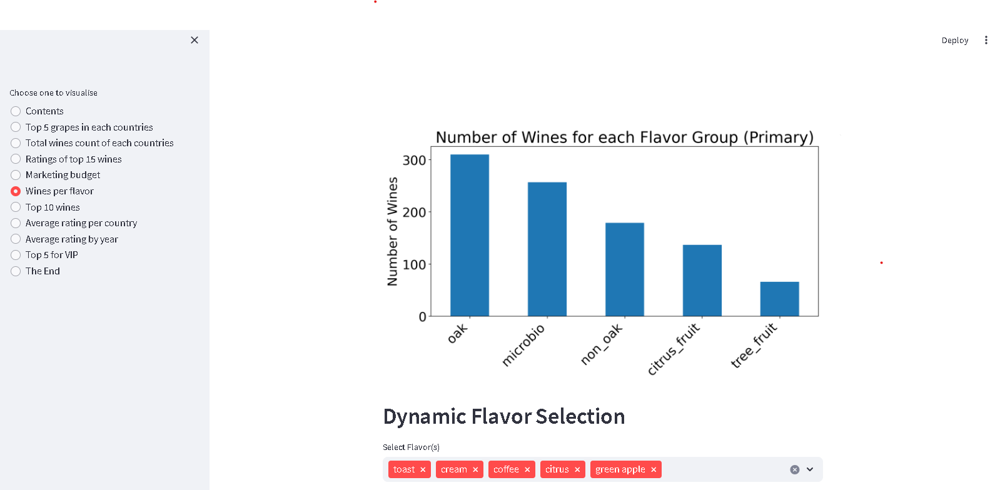
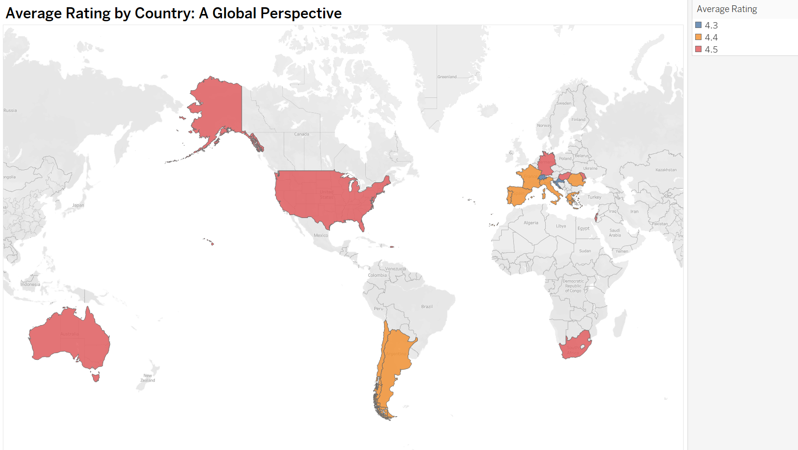
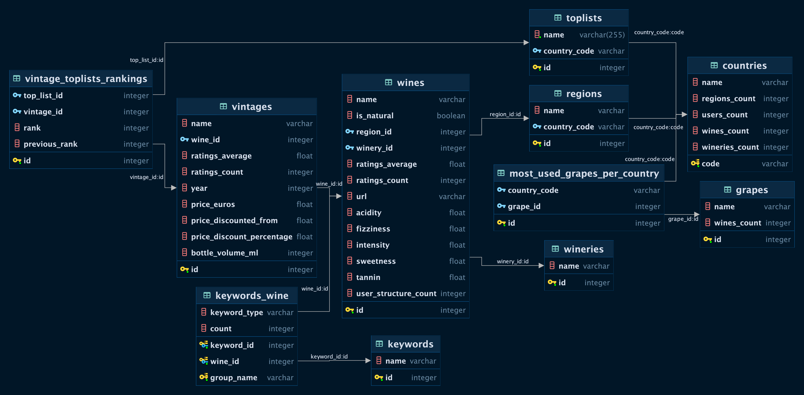

# 🍷 Wine Market Analysis - Vivino 🍷

## 📖 Table of Contents
1. [Introduction](#introduction) 📌 
2. [Description](#description) 📜 
3. [Project Structure](#project-structure) 🚀 
4. [Installation](#installation) 🔧 
5. [Results](#results) 📊 
6. [Database Schema](#database-schema) 📈 
7. [Usage](#usage) 🎮 
8. [Completion](#completion) 🏁 
9. [Acknowledgements](#acknowledgements) 🙏 

## 📌 Introduction
This project, part of the AI Bootcamp in Gent at BeCode.org, aims to analyze wine market data from Vivino, a prominent player in the wine industry. Our goal is to use data aggregation and visualization techniques to answer pressing business questions and provide actionable insights.

## 📜 Description
* This project is based on Data aggregation and Visualisation of 'Wiwinio', active wine industry.
* The company wants to have a better understanding of the wine's market.

The project consists of three main parts:

- Data engineering: Extracting, transforming, and loading the data from different sources into a SQL database. Performing data cleaning, validation, and quality checks. Creating tables, views, and queries to support the analysis.

- Data analysis: Exploring and analyzing the data using SQL and Python. Answering various business questions using descriptive and inferential statistics. Finding insights and patterns in the data.

- Data visualization: Creating interactive dashboards and charts using Streamlit and Tableau. Presenting the results and findings in a clear and engaging way.

## 🚀 Project Structure

1. **Data Engineering**: 
    - Extraction, transformation, and loading of data from disparate sources into a SQL database.
    - Rigorous data cleaning, validation, and quality checks.
    - Crafting tables, views, and queries to underpin the subsequent analysis.
    - Team members:
        - **Sam H (Data Engineer)**: 
            - **Tasks**: 
                - Prioritization of countries based on marketing budget considerations.
                - Identification of wines based on specific keyword clusters with user confirmation and associated group names.
        - **Mythili Palanisamy (Data Engineer & Team Lead)**:
            - **Tasks**:
                - Identify top 3 global grapes and the 5 best-rated wines for each.

2. **Data Analysis**:
    - Exploration and scrutiny of data using SQL and Python.
    - Descriptive and inferential statistics to elucidate business questions.
    - Team member:
        - **Oleksandr Tsepukh (Data Analyst)**:
            - **Tasks**:
                - Craft a country leaderboard based on average wine ratings.
                - Highlight 10 wines for sales augmentation.
                - Recommend top 5 Cabernet Sauvignon wines for a VIP client.

3. **Data Visualization**:
    - Interactive dashboards and charts using Streamlit and Tableau.
    - Data engineers employ **Streamlit** for visualization.
    - Data analysts harness **Tableau** for visualization.
  

## 🔧 Installation

- Clone this repository.
- Install the required modules using `pip install requirements.txt`.

## 📊 Results 

| Platform | Description |
| -------- | ----------- |
| **Streamlit Dashboard** | An interactive platform permitting users to delve deep into the data.  |
| **Tableau Dashboard** | A visual representation of data insights and findings. Ex:  |

## 📈 Database Schema

## 🎮 Usage
1. Navigate to the repository's directory in your terminal.
2. Execute 'streamlit run c:/PATHTOFILE/main.py'

## 🏁 Completion
**Team**: 
- Mythili Palanisamy (Data Engineer & Team Lead) [LinkedIn](https://www.linkedin.com/in/mythili-palanisamy-492147159)
-  Oleksandr Tsepukh (Data Analyst) [LinkedIn](https://www.linkedin.com/in/oleksandr-tsepukh-ba4985279)
- Sam Hoste (Data Engineer) [LinkedIn](https://www.linkedin.com/in/sam-hoste-15610945) 

**Submission**: 31/08/2023, 4:30 PM

## 🙏 Acknowledgements
We would like to thank BeCode for providing us with this opportunity to work on this project. We would also like to thank our coaches and mentors for their guidance and support. Finally, we would like to thank our fellow learners for their feedback and collaboration.
